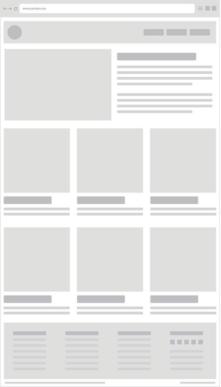

# Intégration web
Exercice d'introduction au module d'intégration web

## Déroulé
1. Créez une copie (fork) de ce repository (après avoir créé votre compte Github si nécessaire).
2. Récupérez votre copie (via la fonction clone) en local sur votre poste de travail.
3. En partant du fichier index.html fourni, mettez en place les codes HTML et CSS nécessaires pour obtenir la mise en page proposée ci-dessous, sans utiliser de feuille de style autre que la vôtre pour le moment.
4. Pensez à push votre code régulièrement, effectuez un push lorsque la mise en page vous semble satisfaisante.
5. _Optionnel_ : importez la feuille de style KNACSS dans votre fichier HTML, puis utilisez-la pour simplifier votre code CSS
6. _Optionnel_ : proposez un rendu responsive pour la mise en page initiale, puis intégrez-la à l'aide de KNACSS

## Mise en page

_source : webflow.com_

## Liens utiles
- Guide de mise en page CSS sur MDN : https://developer.mozilla.org/fr/docs/Apprendre/CSS/CSS_layout
- Introduction à Flexbox sur MDN : https://developer.mozilla.org/fr/docs/Web/CSS/CSS_Flexible_Box_Layout
- Introduction à Grid sur MDN : https://developer.mozilla.org/fr/docs/Web/CSS/CSS_Grid_Layout
- Comparatif Flexbox et Grid sur MDN : https://developer.mozilla.org/fr/docs/Web/CSS/CSS_Grid_Layout/Mod%C3%A8le_de_grille_et_autres_mod%C3%A8les_de_disposition
- Cheatsheet KNACSS : https://www.knacss.com/assets/pdf/knacss7-cheatsheet.pdf
